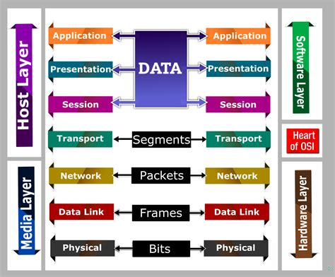

---
tags:
- NET
MOC: Knowledge Base
---

# OSI Model

# Common Ports and Protocols

### 1. FTP - File Transfer Protocol
- Generic file transfer method not specific to any OS
	- It has two ports instead of one
		- tcp/20 (active mode data)
		- tcp/21 (control)
		- The point is that it can authenticate a user with a username and password
	- Among its features are the ability to list, add, delete, etc.

### 2. SSH - Secure Shell
- The Secure Shell meant mainly for text-based console communication but can do more than that
- Works over tcp/22 and deals with encrypted data
- SSH/port 22 is a common finding in the [[EH Enumeration#SSH|enumeration]] step of [[EH Ethical Hacking]]
	- For more insight about exploiting SSH, check-out [[EH Exploitation#SSH|SSH exploitation]]

### 3. SFTP - Secure FTP
- Same as FTP but with security, as in the fact that the data is encrypted
- Uses SSH over tcp/22 for the file transfer
- Same functionality as FTP but in a secure manner. Can even resume interrupted transfers

### 4. Telnet - Telecommunication Network
- Similar functionality to SSH
- Not secure or encrypted, as data is sent plainly
- Works over port tcp/23

### 5. SMTP - Simple Mail Transfer Protocol
- Server to server email transfer
- Works over tcp/25 for plaintext SMTP
- Works over tcp/587 for TLS encrypted SMTP
- Can also send mail from a device to a mail server
	- Commonly configured on mobile devices and email clients
- Other protocols are used for clients to receive email
	- IMAP
	- POP3

### 6. DNS - Domain Name System
- Translates Fully Qualified Domain Names (FQDN) to IP addresses
- Works over udp/53 for small queries, and tcp/53 for large queries

### 7. DHCP - Dynamic Host Configuration Protocol
- Automated configuration of IP address, subnet mask and other options
- Works over udp/67, udp/68
- Requires a DHCP server
	- The router in SOHO (small office home office) networks
	- A standalone server in enterprises
- Dynamic/pooled
	- IP addresses are assigned in real-time from a pool
	- Each system is given a lease, must renew at set intervals
- DHCP reservation
	- Reserved addresses are assigned by MAC address in the DHCP server
	- Quickly manage addresses from one location

### 8. TFTP - Trivial File Transfer Protocol
- Works over udp/69
- Meant for very small transfers such as small configuration files being transferred from one device to another
- No authentication required
	- Not used on highly secure systems
- Useful when starting a system
	- Transfer configuration files
	- Quick and Easy

### 9. HTTP and HTTPS - Hypertext Transfer Protocol
- Communication in the browser and by some applications
- Can be clear or encrypted
	- SSL (Secure Sockets Layer) or TLS (Transfer Layer Security)
- HTTP uses tcp/80 for web server communication
- HTTPS uses tcp/443 for encrypted web server communication over TLS (new) or SSL (old)

### 10. NTP - Network Time Protocol
- Switches, routers, firewalls, servers, workstations
	- Every device has it's own clock
	- Works over udp/123
- Synchronizing the clocks becomes critical
	- Log files, authentication information, outage details
- Automatic updates
	- No flashing 12:00 lights
- Flexible - You control how clocks are updated
- Very accurate
	- Accuracy is better than 1 millisecond on a local network

### 11. SNMP - Simple Network Management Protocol
- Gather statistics from network devices
	- Uses udp/161
- v1 - The original
	- Structured tables
	- In-the-clear
- v2 - A good step ahead
	- Data type enhancements
	- Bulk transfers
	- Still in-the-clear
- v3 - A secure standard
	- Message integrity
	- Authentication
	- Encryption
- SNMP traps
	- Alerts and notifications from the network devices
	- Uses udp/162
-  

### 12. LDAP and LDAPS - Lightweight Directory Access Protocol
- Store and retrieve information in a network directory to keep track of devices on a network, users using them, and the relationship between the users and devices, and stores the data in a database
- LDAP allows us to query the database and retrieve the information we need
- Works over tcp/389
- LDAPS is a non-standard implementation of LDAP over SSL
	- Uses tcp/636
- Uses a hierarchical structure and categorizes devices the organization into units in a tree structure
- 

### 13. SMB - Server Message Block
- **Refer To:** 
	- [[EH Enumeration#smbclient]]
- Protocol used by Microsoft Windows
	- The data is stored in files on the network in a file share
	- File sharing, printer sharing
	- Also called CIFS - Common Internet File System
- Integrated into the windows OS
	- Access rights integration across systems
	- File share publishing
	- File locking
- Used to use NetBIOS (tcp/139)
- Now it's direct SMB communication using IP over  tcp/445 (NetBIOS-less)

### 14. Syslog
- Standard for message logging
	- Diverse systems, consolidated log
	- Uses udp/514
- Usually needs a central log collector
	- Integrated into the SIEM - Security Information and Event Manager
- Needs a lot of disk space such as a NAS

### 15. Databases
- Collection of information
	- Many different types of data
	- One common method to store and query
- Structured Query Language (SQL)
	- A standard language across database servers
	- Example: SELECT * FROM Customers WHERE Last_Name='Messer';
- Microsoft has it's own form of SQL database called Microsoft SQL server or MS-SQL - Microsoft Structured Query Language
	- Uses tcp/1433
- There are other SQL database types using different port numbers

### 16. RDP - Remote Desktop Protocol
- Share a desktop from a remote location over tcp/3389
	- Connect to an entire desktop or just an application
- Remote Desktop Services are meant for windows devices
	- There are however clients for Windows, MacOS, Linux, Unix, iPhone, and others that can be used to connect to those windows devices

### 17. SIP - Session Initiation Protocol
- Voice over IP (VoIP) signaling
- Works over tcp/5060 and tcp/5061
- Setup and manage VoIP sessions
	- Call, ring, play busy signal, hang up
- Extend voice communication
	- Video conferencing
	- Instant messaging
	- File transfer
	- etc.

### 18. ICMP - Internet Control Message Protocol
- The protocol used by the ping command to verify if a device is connected and available on the network
- Protocol that's carried by IP and not used for data transfer
- Devices can request and reply to administrative requests
- Can also inform you if you try to connect to an unreachable network, that it's in fact unreachable
- Can also tell you that your TTL - Time To Live expired via a time exceeded message

### 19. GRE - Generic Routing Encapsulation
- Creates a tunnel between communicating devices that makes it seem as if they were directly connected
- Encapsulates packets within IP packets, creating a virtual point-to-point link
- Commonly used by VPN
- Encapsulates traffic inside of IP
	- Two endpoints appear to be directly connected to each other
	- No built-in encryption
	- 

### 20. VPN - Virtual Private Network
- Encrypted and private data traversing a public network
- Can be used to encrypt and protect data sent over a tunnel
- Concentrator
	- Encryption/decryption access device
	- Often integrated into a firewall
- Many deployment options
	- Specialized cryptographic hardware
	- Software-based options available
- Site to site VPN
	- Always-on (almost)
	- Firewalls often act as VPN concentrators
		- Probably already have firewalls in place

### 21. IPSec - Internet Protocol Security
- One of the most common VPN encryption protocols
- Security for OSI layer 3
	- Authentication and encryption for every packet
- Confidentiality and integrity/anti-replay
	- Encryption and packet signing
- Very standarized
	- Common to use multi-vendor implementations
	- Firewalls from different vendors can connect without issue
- Two core IPSec protocols
	- Authentication Header (AH)
	- Encapsulation Security Payload (ESP)

### 22. Internet Key Exchange (IKE)
- A prior step to tunnel creation where we first agree on the encryption method to use
- Agree on encryption/decryption keys
	- Without sending the key across the network
	- Builds a Security Association (SA)
- Phase 1
	- Use Diffie-Hellman to create a shared secret key
	- Uses udp/500
	- ISAKMP - Internet Security Association and Key Management Protocol
- Phase 2
	- Coordinate ciphers and key sizes
	- Negotiate an inbound and outbound SA for IPSec
- 

### 23. Transport mode and Tunnel mode
- Transport mode inserts an IPSec Header between the IP Header and the data, and ends with an IPSec Trailer
	- The IPs are in the clear but the data is encrypted
	- If the data is captured, the original IP Header can be seen and traced back to the sender
- Tunnel mode inserts the IPSec Header and Trailer around the IP Header and Data, and adds a new IP Header at the very start
- 
- Tunnel mode is the most used mode for the upmost security

### 24. Authentication Header (AH)
- Provides data integrity and authentication using HMAC 
	- SHA-1, SHA-256, SHA-384, or SHA-512 are common (MD5 is deprecated) 
	- Does NOT provide encryption/confidentiality
	- Adds the AH to the packet header
	- 

### 25. Encapsulation Security Payload (ESP)
- Encrypts the packet
	- SHA-1, SHA-256+ for authentication; AES, ChaCha20 for encryption (3DES/MD5 deprecated) 
	- Provides both encryption AND authentication 
	- Can be used with or without AH
	- Adds a header, a trailer, and an Integrity Check Value
	- 