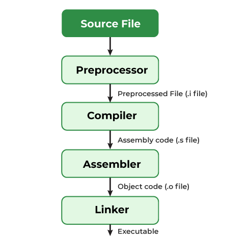

---
tags:
- C
- Programming-Language
MOC: Programming
---
[[_0000 Home|Home]] | [[_0006 Programming MOC|Back to Programming MOC]] | [[PG C index|Back to index]]

# Preprocessor
- Compilation starts here
- In this phase, the source code is prepared by:
	- Removing comments
	- expanding macros
	- Resolving conditional compilation
	- Resolving includes (The preprocessor replaces the includes line with the contents of the header file, and all of its headers (function prototypes/definitions, global variables, etc...), inserting that code into the main file calling it)
# Compiler
- The code is compiled into assembly code
- Many compilers convert the provided code into an intermediate language
# Assembler
- Technically another compiler that converts the assembly code into machine code (ones and zeros)
- The resulting object file can't be ran yet, as GCC still needs to resolve the position within the binary where functions will be placed
- If your main file "main.c" has been converted at this point into a "main.o" then other libraries such as the "stdio.c" library where the `printf` function lives, must also be compiled into an "stdio.o" file
# Linker
- Here, we should have multiple object files
- The linker's job is to combine all of them into a single executable
- This can be done in 2 ways:
	- #### Static linking
		- Taking the machine code of each required function from the library, and adding it to the final executable
		- This makes everything self contained and ready to run at any give moment
	- #### Dynamic linking
		- Libraries get compiled into dynamic shared library files e.g: **.so** on unix systems, or **.dl**" on windows
		- These files are saved only once, saving up on disk space and memory, and won't have an entry point to start execution since they have no main function
		- Here, the linker wont copy the code of the function from the library directly to the executable, but would rather add a reference to it
		- At runtime, when a function from a dynamic library is needed, the OS will add that function into the main address space of the process, and the program can use it as if its part of the executable