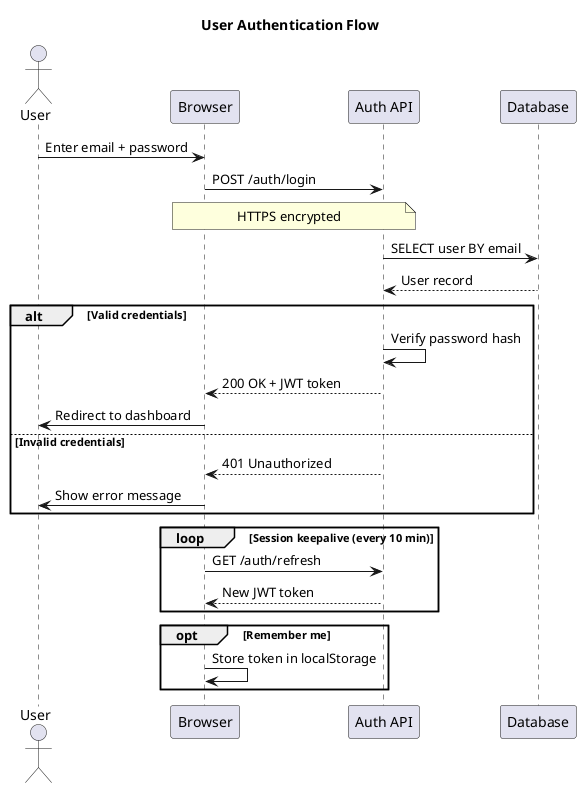

[[_0000 Home|Home]] | [[_0006 Programming MOC|Back to Programming MOC]] | [[PG Other index|Back to index]]

## ByteByteGo guides
![[Linkedin_Posts_2024_Blue.pdf]]
## Simplest login flow
```plantuml
title User Login Flow

actor User
participant Browser
participant "Auth Server" as Auth
participant Database

User->Browser: Enter credentials
Browser->Auth: POST /api/login
Auth->Database: SELECT * FROM users
Database-->Auth: User record
Auth->Auth: Verify password hash
Auth-->Browser: JWT token + refresh token
Browser-->User: Redirect to dashboard
```

## Expanded authentication flow

