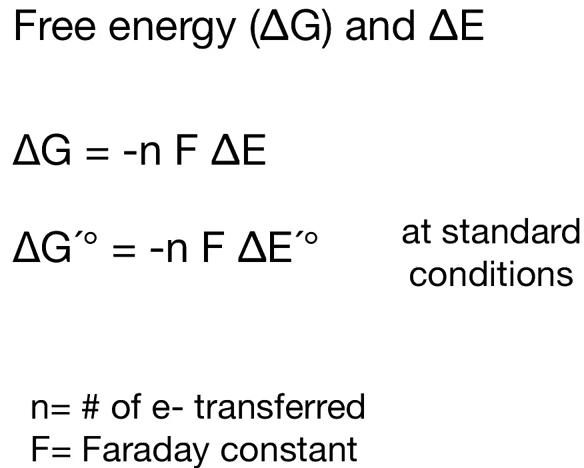

[[_0000 Home|Home]] | [[_0004 Sciences MOC|Back to Sciences MOC]] | [[SC Biochemistry index|Back to index]]
# Gibbs free energy equation: (1-3 unit 1)

**dG = dH - TdS**

# Standard change in free energy of reaction:

# **dGo = -RTln(Keq)**

# None-standard change in free energy of reaction:

**dG = dGo + RTln(K)**

# Change in free energy in relation to change in reduction potential: (4-6 unit 3.5.2)

# Standard change in reduction potential:

# None-standard change in reduction potential(Nernst equation):

