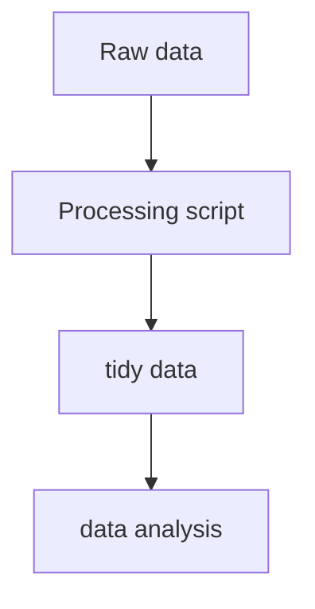

---
tags:
- DS
MOC: Sciences
---
[[_0000 Home|Home]] | [[_0004 Sciences MOC |Back to Sciences MOC]] | [[SC Datascience index|Back to index]]


# Getting and Cleaning Data
- The data life cycle looks something like this

## Raw and processed data
- We can define data as "Qualitative or quantitative variables belonging to a set of items" where a set of items is the set of objects we're interested in, sometimes called the population
	- A variable is a characteristic of an item
	- Qualitative variables are like country of origin, sex, treatment. So categorical values
	- Quantitative variables are like height, weight, blood pressure. Numerical data that can be represented on a linear regression line basically
	- Quantitative variables are normally derived from lower lever measurements
### Raw data
- This is the original source of the data
- It's often hard to use for data analyses
- Requires processing
- It's important to note that raw data, is subjective, it's really raw to you if you haven't done any processing on it, even if someone else did
### Processed data
- Data which is ready for analysis
- Processing can include merging, subsetting, transforming, etc
- There are usually processing standards depending on the area of study
- All the processing steps that were used must be recorded
- Processing is usually the most important step of the data analysis process due to its effect on the downstream data
### Tidy data
#### Components of tidy data
- The raw data
- A tidy data set
- A code book describing each variable and its values in the tidy set
- An explicit and exact recipe you used to go from step 1 to 2 to the end
- The data is considered tidy when
	- Each variable forms a column
	- Each observation forms a row
	- Each type of observational unit forms a table
	- Different tables have a raw that allows them to be linked (a foreign key?)
- Data should preferably be saved in the form of 1 file per table
- An example of messy data
```R
> students
  grade male female
1     A    5      3
2     B    4      1
3     C    8      6
4     D    4      5
5     E    5      5
```
- The above table is messy because values are being used as variables
- To elaborate, the proper way for structuring this table, would be to have grade, sex, and count, instead of the value of the variable itself, male and female, being columns
```R
> gather(students, sex, count, -grade)
  grade    sex count
1      A   male     5
2      B   male     4
3      C   male     8
4      D   male     4
5      E   male     5
6      A female     3
7      B female     1
8      C female     6
9      D female     5
10     E female     5
```
- We can tidy this data using [[PG R Main#Tidyr|Tidyr]]. Usage examples will be covered in [[PG R Main]]
- In the cleaned dataset, we grouped male and female under the sex column, and their counts under the count column
- A good indication that a single table has multiple observational units, is if redundant data is found
```R
    id  name sex class midterm final
1  168 Brian   F     1       B     B
2  168 Brian   F     5       A     C
3  588 Sally   M     1       A     C
4  588 Sally   M     3       B     C
5  710  Jeff   M     2       D     E
6  710  Jeff   M     4       A     C
7  731 Roger   F     2       C     A
8  731 Roger   F     5       B     A
9  908 Karen   M     3       C     C
10 908 Karen   M     4       A     A
```
- In the above example, we have have duplicated entries for the same students
- A good solution in this case, would be to break this table into two separate ones
```R
   id  name sex
1 168 Brian   F
3 588 Sally   M
5 710  Jeff   M
7 731 Roger   F
9 908 Karen   M

    id class midterm final
1  168     1       B     B
2  168     5       A     C
3  588     1       A     C
4  588     3       B     C
5  710     2       D     E
6  710     4       A     C
7  731     2       C     A
8  731     5       B     A
9  908     3       C     C
10 908     4       A     A
```
#### The code book
- This is where you store information about the variables, including their measurement units, which may not appear in the tidy set itself
- Information about your summary choices
- Information about the experimental study design that you used
- This file is normally just a word or text file. Markdown is also possible though
- It should include a section titled "Study design" that explains how the data was collected, in detail
- There must also be a section named "Code book" that does the actual function of describing the variables and their units
#### The instruction list
- This is ideally a script, in R or some other language
- The input is the raw data and the output is the processed data
- The script should also not have any parameters, this is an idempotent piece of software that anyone can run at any time on that specific raw data and always get the same output
- Not every step in the processing can be included in the script though, in which case instructions are in order
- These instructions are also steps of the process, but written down for the end user to follow instead of running automatically with the script, such as asking the user to use some third part software on the raw data to get it to the desired form the cript will then run on
- It could also involve asking the user to run the script on pieces of the raw data, instead of passing the whole thing all at once, or just asking the user to do some final tweaks to the output by hand
#### Data formats
- Data normally comes in one of 2 formats, wide, or long
- The wide formats has data taking a rectangular shape, where each column is a variable and each row is an observation
- That's basically how a SQL database tends to look, for example
![[Pasted image 20260614010541.png]]
- In the long format, data type is stored in 1 column, and the values in another, so that each row has a single observation for a single variable
![[Pasted image 20260614010638.png]]
- It's important to understand that data storage in easier in the wide format, which is more readable, but working with data is easier in the long format, so easy conversion between the two formats is important
## Tidying and manipulating data
### Dplyr
![[data-transformation.pdf]]
- Dplyr is a package meant for manipulating tabular data
- It can work with a variety of table types like data frames, data tables, databases, and multidimensional arrays
- The first step for working with dyplr is to load data into a data frame table using `tbl_df`
	- Note that `tbl_df` is supposedly deprecated, but it wasn't for the swirl lesson, so I need to check what it is now
- dplyr's data frame tables have a nicer print format than normal data frames
- dplyr has 5 main functions that cover most of the operations it can do
	- `select`
	- `filter`
	- `arrange`
	- `mutate`
	- `summarize`
- To select columns from a table, we can use select in the following way
```R
> select(cran, ip_id, package, country)
# A tibble: 225,468 × 3
   ip_id package      country
   <int> <chr>        <chr>  
 1     1 htmltools    US 2     2 tseries      US 3     3 party        US 4     3 Hmisc        US 5     4 digest       CA 6     3 randomForest US 7     3 plyr         US 8     5 whisker      US 9     6 Rcpp         CN     
10     7 hflights     US     
# ℹ 225,458 more rows
# ℹ Use `print(n = ...)` to see more rows
```
#### Select
- Select spares us from having to use the usual `$` operator for accessing tabular data
- The data is also arranged in the order it was specified in in `select` not the order in the actual table
- We can also select a range of columns `select(cran, r_arch:country)`
- The same can be done in reverse order `select(cran, country:r_arch)`
- We can also omit columns while selecting `select(cran, -time)`
- We can also omit a range of columns  `select(cran, -(X:size))`
#### Filter
- Filter is how we subset data with dplyr `filter(cran, package == "swirl")`
- A more conditional example `filter(cran, r_version == "3.1.1", country == "US")`
- It's also possible to do an `or` comparison instead of `and` `filter(cran, country == "US" | country == "IN")`
#### Arrange
- By default, `arrange` arranges the table in ascending order, based on the selected column `arrange(cran2, ip_id)`
- To do the same in descending order `arrange(cran2, desc(ip_id))`
- We can also arrange by multiple columns `arrange(cran2, package, ip_id)`
	- In this case, we first arrange the table alphabetically by the package name (since it's a string), then, if multiple package values are the same, they will be ordered in ascending order, by the value of ip_id
- This means that order matters with `arrange`
#### Mutate
- Mutate can be used to create a new column in the table
- Assume we have a size column in bytes, and we want to add another column with the size in MB
```R
> mutate(cran3, size_mb = size / 2^20)
# A tibble: 225,468 × 4
   ip_id package         size size_mb
   <int> <chr>          <int>   <dbl>
 1     1 htmltools      80589 0.0769 
 2     2 tseries       321767 0.307  
 3     3 party         748063 0.713  
 4     3 Hmisc         606104 0.578
```
- It's even possible to use mutate to compute a new column, and in the same command, compute a 3rd column from that 2nd column
```R
> mutate(cran3, size_mb = size / 2^20, size_gb = size_mb / 2^10)
# A tibble: 225,468 × 5
   ip_id package         size size_mb    size_gb
   <int> <chr>          <int>   <dbl>      <dbl>
 1     1 htmltools      80589 0.0769  0.0000751 
 2     2 tseries       321767 0.307   0.000300  
 3     3 party         748063 0.713   0.000697
```
- Mutate can also overwrite an existing column if we assign a new value to it, instead of making a new column
#### Summarize
- This one collapses the dataset into a single row, based on the aggregation value that we want
```R
> summarize(cran, avg_bytes = mean(size))
# A tibble: 1 × 1
  avg_bytes
      <dbl>
1   844086.
```
#### Group by
- dplyr also provides us with a function for grouping data, based on a specific column
```R
> by_package <- group_by(cran, package)
> > by_package
# A tibble: 225,468 × 11
# Groups:   package [6,023]
       X date       time        size r_version r_arch r_os      package      version country ip_id
   <int> <chr>      <chr>      <int> <chr>     <chr>  <chr>     <chr>        <chr>   <chr>   <int>
 1     1 2014-07-08 00:54:41   80589 3.1.0     x86_64 mingw32   htmltools    0.2.4   US          1
 2     2 2014-07-08 00:59:53  321767 3.1.0     x86_64 mingw32   tseries      0.10-32 US          2
 3     3 2014-07-08 00:47:13  748063 3.1.0     x86_64 linux-gnu party        1.0-15  US          3
 4     4 2014-07-08 00:48:05  606104 3.1.0     x86_64 linux-gnu Hmisc        3.14-4  US          3
```
- Now that our table is grouped, if we use `summarize` again, we will get aggregations on a per package basis, instead of a single row
```R
> summarize(by_package, mean(size))
# A tibble: 6,023 × 2
   package     `mean(size)`
   <chr>              <dbl>
 1 A3                62195.
 2 abc             4826665 
 3 abcdeFBA         455980.
 4 ABCExtremes       22904.
 5 ABCoptim          17807.
```
- The following example will make use of 2 new dply functions, `n` and `n_distinct`, which are basically `wc`, and `unique -c`, from [[TECH CLI Tools and Commands#File operations|linux CLI]]
```R
> pack_sum <- summarize(by_package,
                      count = n(),
                      unique = n_distinct(ip_id),
                      countries = n_distinct(country),
                      avg_bytes = mean(size))
                      
> pack_sum
# A tibble: 6,023 × 5
   package     count unique countries avg_bytes
   <chr>       <int>  <int>     <int>     <dbl>
 1 A3             25     24        10    62195.
 2 abc            29     25        16  4826665 
 3 abcdeFBA       15     15         9   455980.
 4 ABCExtremes    18     17         9    22904.
 5 ABCoptim       16     15         9    17807.
```
#### Chaining (the chain operator)
- The chaining operator was later changed to be `|>`
- R support higher order functions, so we can do some function chaining, functional programming style
- However, dplyr provides a nicer, more readable solution, akin to how linux CLI tackles that same challenge
- Introducing the chain operator `%>%`
```R
by_package <- group_by(cran, package)
pack_sum <- summarize(by_package,
                      count = n(),
                      unique = n_distinct(ip_id),
                      countries = n_distinct(country),
                      avg_bytes = mean(size))

top_countries <- filter(pack_sum, countries > 60)
result1 <- arrange(top_countries, desc(countries), avg_bytes)

print(result1)

# Equals
result2 <-
  arrange(
    filter(
      summarize(
        group_by(cran,
                 package
        ),
        count = n(),
        unique = n_distinct(ip_id),
        countries = n_distinct(country),
        avg_bytes = mean(size)
      ),
      countries > 60
    ),
    desc(countries),
    avg_bytes
  )

print(result2)

# Equals
result3 <-
  cran %>%
  group_by(package) %>%
  summarize(count = n(),
            unique = n_distinct(ip_id),
            countries = n_distinct(country),
            avg_bytes = mean(size)
  ) %>%
  filter(countries > 60) %>%
  arrange(desc(countries), avg_bytes)

print(result3)
```
- When using the chaining operator, we don't need to specify the name of the table being passed to any of the 5 functions again (or any function), as that's a given now
```R
cran %>%
  select(ip_id, country, package, size) %>%
  mutate(size_mb = size / 2^20) %>%
  filter(size_mb <= 0.5) %>%
  arrange(desc(size_mb))
```
#### Other functions
- %>% - pipe operator for chaining a sequence of operations
- `glimpse` - get an overview of what’s included in dataset 
- `filter` - filter rows
- `select` - select, rename, and reorder columns
- `rename` - rename columns
- `arrange` - reorder rows
- `mutate` - create a new column
- `group_by` - group variables
- `summarize` - summarize information within a dataset
- `left_join` - combine data across data frame
- `tally` - get overall sum of values of specified column(s) or the number of rows of tibble
- `count` - get counts of unique values of specified column(s) (shortcut of group_by` and tally())
- `add_count` - add values of count() as a new column
- `add_tally` - add value(s) of tally() as a new column
### Tidyr
- A package for tidying messy data, that's dependent on the functionalities of dplyr, as it comes from the same ecosystem
#### Gather
- This function has been superseded by `pivot_longer`
- The `gather` function can do a sort of a pivot where it switches columns from being variables, to being values, or from columns to rows
```R
> gather(students, sex, count, -grade)
  grade    sex count
1      A   male     5
2      B   male     4
3      C   male     8
4      D   male     4
5      E   male     5
6      A female     3
7      B female     1
8      C female     6
9      D female     5
10     E female     5
```
- `gather` arguments are, the original dataset first, then a key, and a value arguments, which here were sex and count respectively. This gives the column names for the tidy dataset. Lastly, -grade meant that we want to gather all columns, except for grade, since this was already a proper column
#### Separate
- This function has been superseded by `separate_wider_position` and `separate_wider_delim`
- In the following example, we have data that suffers from two issues
	- Values are being used as variables again
	- Multiple values are grouped as one column
```R
> students2
  grade male_1 female_1 male_2 female_2
1     A      7        0      5        8
2     B      4        0      5        8
3     C      7        4      5        6
4     D      8        2      8        1
5     E      8        4      1        0
```
- This requires two cleanup steps, one of which we already used once
```R
> res <- gather(students2, sex_class, count, -grade)
> res
   grade sex_class count
1      A    male_1     7
2      B    male_1     4
3      C    male_1     7
4      D    male_1     8
5      E    male_1     8
6      A  female_1     0
7      B  female_1     0
8      C  female_1     4
9      D  female_1     2
10     E  female_1     4
11     A    male_2     5
12     B    male_2     5
13     C    male_2     5
14     D    male_2     8
15     E    male_2     1
16     A  female_2     8
17     B  female_2     8
18     C  female_2     6
19     D  female_2     1
20     E  female_2     0
```
- This solved the row values being used as column variables problem, but we still have 2 different columns grouped as one, gender/sex and class
- To solve this, we can use `separate` which literally does the opposite of gather
```R
> separate(res, sex_class, c("sex", "class"))
   grade    sex class count
1      A   male     1     7
2      B   male     1     4
3      C   male     1     7
4      D   male     1     8
5      E   male     1     8
6      A female     1     0
7      B female     1     0
8      C female     1     4
9      D female     1     2
10     E female     1     4
11     A   male     2     5
12     B   male     2     5
13     C   male     2     5
14     D   male     2     8
15     E   male     2     1
16     A female     2     8
17     B female     2     8
18     C female     2     6
19     D female     2     1
20     E female     2     0
```
- Note that `separate` assumes the separator is non-alphanumeric, so it separated our data based on the underscore `_`
- We can control this behavior with the `sep` argument
- It seems however to be good practice when creating a column that will be separated in a following step, to name it using the to column names it will be separated into, separated by an underscore
#### Spread
- Spread is used to separate a column again, but this time, it will basically replace the value column with the values of the key column as the new headers
```R
> res
    name    test  class grade
1  Sally midterm class1     A
2  Sally   final class1     C
9  Brian midterm class1     B
10 Brian   final class1     B
13  Jeff midterm class2     D
14  Jeff   final class2     E
15 Roger midterm class2     C
16 Roger   final class2     A
21 Sally midterm class3     B
22 Sally   final class3     C
27 Karen midterm class3     C
28 Karen   final class3     C
33  Jeff midterm class4     A
34  Jeff   final class4     C
37 Karen midterm class4     A
38 Karen   final class4     A
45 Roger midterm class5     B
46 Roger   final class5     A
49 Brian midterm class5     A
50 Brian   final class5     C
> spread(res, test, grade)
    name  class final midterm
1  Brian class1     B       B
2  Brian class5     C       A
3   Jeff class2     E       D
4   Jeff class4     C       A
5  Karen class3     C       C
6  Karen class4     A       A
7  Roger class2     A       C
8  Roger class5     A       B
9  Sally class1     C       A
10 Sally class3     C       B
```
#### readr
- This is more of an honorable mention, as `readr` is a separate package, but we used the `parse_number` function from the package
- `parse_number` basically takes a string that has a number in it, and returns just the number
- We use this function inside `mutate` to change all the values of class, to just numbers
- `readr`also has a bunch of upgraded reading and writing functions, in relation to the built-in utils, such as `read_csv` and `write_csv`
#### Bind_rows
- We covered a couple more examples, but the one I'm noting here is where we used `bind_rows`, which is a function that can join two identical tables into a bigger one
```R
> passed
   name class final
1 Brian     1     B
2 Roger     2     A
3 Roger     5     A
4 Karen     4     A

> failed
   name class final
1 Brian     5     C
2 Sally     1     C
3 Sally     3     C
4  Jeff     2     E
5  Jeff     4     C
6 Karen     3     C

> passed <- mutate(passed, status = "passed")
> failed <- mutate(failed, status = "failed") 

> bind_rows(passed, failed)
    name class final status
1  Brian     1     B passed
2  Roger     2     A passed
3  Roger     5     A passed
4  Karen     4     A passed
5  Brian     5     C failed
6  Sally     1     C failed
7  Sally     3     C failed
8   Jeff     2     E failed
9   Jeff     4     C failed
10 Karen     3     C failed
```
#### pivot_longer
- As mentioned before data is usually stored in wide format, but is easier to work with in long format
- Tidyr gives us the `pivot_longer` and `pivot_wider` functions to allow us to reshape the data into either format
```R
gathered = airquality |> pivot_longer(everything(), names_to = "variable", values_to = "value")
```
![[Pasted image 20260614205811.png]]
- Pivoting to long format doesn't necessarily mean that we have to move everything into the variable and value columns
- On the contrary, some columns are important for identifying our rows, such as the day in the airquality set
- In that case, we would like to specify explicitly, which columns should go into the variables column
```R
gathered <- airquality |>
			pivot_longer(c(Ozone, Solar.R, Wind, Temp),
			names_to = "variable",
			values_to = "value")
```
![[Pasted image 20260614210208.png]]
#### pivot_wider
- Since data is best stored in the wide format, then once done with the data, we may want to store the output in wide format again using `pivot_wider`
- Although the order of the columns wont necessarily be the same
```R
spread_data <- gathered %>%
			pivot_wider(names_from = "variable",
			values_from = "value")
```
![[Pasted image 20260614210452.png]]
#### Other functions
- `unite` - combine contents of two or more columns into a single column
- `separate` - separate contents of a column into two or more columns
### Janitor
- Not a direct member of the tidyverse, but considered an adjacent package used for cleaning messy data
- `clean_names` - clean names of a data frame
- `tabyl` - get a helpful summary of a variable
- `get_dupes` - identify duplicate observations
### Skimr
- The whole purpose of this package is to summarize a dataframe or tibble within, specifically within the tidy dataframework
- `skim` - summarize a data frame
## Data acquisition
### Downloading Data
- This following section, and probably many more will be closely related to, and heavily reliant on [[PG R Main|R]]
- Refer to [[PG R Main#Files and directories]] for this section
- It's good practice after downloading data from the internet to also set the date in a variable as a point of reference for if/when the data changes at the source
### Reading from databases
- We can also establish connections to data bases like MySQL and read from the directly
- More information on this here [[PG R Main#MySQL]]
### MySQL
- This section was explained with MySQL as an example, but it should work for all DB connections in general
- The command to connect to a MySQL DB is `dbConnect`, and then we can do a `get` query with `dbGetQuery`
```R
> ucscDb = dbConnect(MySQL(), user="genome", host="genome-mysql.cse.ucsc.edu")
> ucscDb
> result = dbGetQuery(ucscDb, "show databases;"); dbDisconnect(ucscDb);
> result
              Database
1              acaChl1
2              ailMel1
3              allMis1
4              allSin1
5              amaVit1
6              anaPla1
7              ancCey1
8              angJap1
9              anoCar1
10             anoCar2
```
- `show databases;` is a MySQL specific command that shows all the available databases in the running MySQL server
- The example was being done on the "hg19" database, which at the time was a recent build of the human genome
```R
> hg19 = dbConnect(MySQL(), user="genome", db="hg19", host="genome-mysql.cse.ucsc.edu")
> allTables = dbListTables(hg19)
> length(allTables)
[1] 12725
```
- We can also show all the fields in a table
```R
> dbListFields(hg19, "affyU133Plus2")
 [1] "bin"         "matches"     "misMatches"  "repMatches"  "nCount"      "qNumInsert"  "qBaseInsert"
 [8] "tNumInsert"  "tBaseInsert" "strand"      "qName"       "qSize"       "qStart"      "qEnd"       
[15] "tName"       "tSize"       "tStart"      "tEnd"        "blockCount"  "blockSizes"  "qStarts"    
[22] "tStarts"
```
- `dbGetQuery` is used to write raw SQL, so as an example
```R
> dbGetQuery(hg19, "select count(*) from affyU133Plus2")
  count(*)
1    58463
```
- To load data from a table into a data frame
```R
> affyData = dbReadTable(hg19, "affyU133Plus2")
> head(affyData)
  bin matches misMatches repMatches nCount qNumInsert qBaseInsert tNumInsert tBaseInsert strand
1 585     530          4          0     23          3          41          3         898      -
2 585    3355         17          0    109          9          67          9       11621      -
3 585    4156         14          0     83         16          18          2          93      -
4 585    4667          9          0     68         21          42          3        5743      -
```
- `dbSendQuery` is a command that sends a SQL query, but doesn't return any data until the returned query itself is passed to a `fetch` command
```R
> query = dbSendQuery(hg19, "select * from affyU133Plus2 where misMatches between 1 and 3")
There were 16 warnings (use warnings() to see them)
> affyMis = fetch(query); quantile(affyMis$misMatches)
  0%  25%  50%  75% 100% 
   1    1    2    2    3
```
- You can also specify the amount of return data that you want
- It's important to also clear the query once you're done
```R
> affyMiSmall = fetch(query,n=10); dbClearResult(query);
[1] TRUE
```
#### Subsetting
- Although this has been covered in [[PG R Main#Subsetting]], and is more of an R topic, I will cover the extended version here as it portrays to tidying data more than just pure subsetting
- It's also good to know that [[PG R Main#Dplyr|dplyr]] can handle subsetting in a much nicer and more intuitive way, but the following is how this is done with the base package
- Another way for dealing with NA values is via the `which` function
```R
X[which(X$var2 > 8),]
```
- `which` will return the indexes of all the rows that satisfy the specified condition, while ignoring NAs
- The `sort` function, is very self explanatory, and has a flag for placing all NAs at the very end of the sort
- `order` can help sort a data frame by a particular column
```R
x[order(X$var1),]
```
- We can also order by multiple columns
```R
x[order(X$var1, X$var3),]
```
- We can easily add rows to a data frame
```R
X$var4 = rnorm(5)
# or
Y = cbind(X, rnorm(5))
```

### HDF (hierarchical data format)
- This format is used for storing large data sets
- It supports storing a range of data types
- The groups can contain zero or more data sets and metadata
	- Each group has a header with a group name and attributes list
	- Each group has a symbol table with a list of objects in the group
- Datasets are multidimensional
	- They have a header with a name, datatype, dataspace, and storage layout
	- They also have a data array with the actual data
- This package can be installed from bioconductor, and it can optimize reading and writing to disk in R
- The first thing we can do with it, is create a file
```R
> created = h5createFile("example.h5")
```
- We can then add groups to the file
```R
> created = h5createGroup("example.h5", "foo")
> created = h5createGroup("example.h5", "baa")
> created = h5createGroup("example.h5", "foo/foobaa")
> h5ls("example.h5")
  group   name     otype dclass dim
0     /    baa H5I_GROUP           
1     /    foo H5I_GROUP           
2  /foo foobaa H5I_GROUP
```
#### Writing
- We can then write to the groups
```R
> A = matrix(1:10, nr=5, nc=2)
> h5write(A, "example.h5", "foo/A")
> B = array(seq(0.1,2.0,by=0.1),dim=c(5,2,2))
> attr(B, "scale") = "liter"
> h5write(B, "example.h5", "foo/foobaa/B")
> h5ls("example.h5")
        group   name       otype  dclass       dim
0           /    baa   H5I_GROUP                  
1           /    foo   H5I_GROUP                  
2        /foo      A H5I_DATASET INTEGER     5 x 2
3        /foo foobaa   H5I_GROUP                  
4 /foo/foobaa      B H5I_DATASET   FLOAT 5 x 2 x 2

> df = data.frame(1L:5L,seq(0,1,length.out=5),
+ c("ab", "cde","fghi","a","s"), stringsAsFactors=FALSE)
> h5write(df, "example.h5", "df")
> h5ls("example.h5")
        group   name       otype   dclass       dim
0           /    baa   H5I_GROUP                   
1           /     df H5I_DATASET COMPOUND         5
2           /    foo   H5I_GROUP                   
3        /foo      A H5I_DATASET  INTEGER     5 x 2
4        /foo foobaa   H5I_GROUP                   
5 /foo/foobaa      B H5I_DATASET    FLOAT 5 x 2 x 2
```
- When we added `df` directly without specifying a group, it got added to the root group
#### Reading
- We can also read from the file
```R
> readA = h5read("example.h5", "foo/A")
> readB = h5read("example.h5", "foo/foobaa/B")
> readdf = h5read("example.h5", "df")
> readA
     [,1] [,2]
[1,]    1    6
[2,]    2    7
[3,]    3    8
[4,]    4    9
[5,]    5   10
```
#### Writing and Reading chunks
- We can also specify indexes to write to within a dataset, within a group
```R
> h5write(c(12,13,14), "example.h5", "foo/A", index=list(1:3,1))
> h5read("example.h5", "foo/A")
     [,1] [,2]
[1,]   12    6
[2,]   13    7
[3,]   14    8
[4,]    4    9
[5,]    5   10
```
### Scraping the web
- Webscraping is the act of programatically extracting data from the HTML code of websites
- Note however that this an be against the TOS of some websites, and that reading many pages too fast can get your IP banned
- It's still a great way for getting data from websites
#### Reading from the web
- To establish a web connection, we use the `url` function
```R
con = url("http://example.com/path")
htmlCode = readLines(con)
close(con)
```
- Since we're reading html data, that would be a good opportunity to use [[#HTML]] for parsing the returning HTML content
##### Authentication
- To access websites with passwords, we will require the `GET` function from the `httr` package
```R
pg1 = GET("http://example.com", authenticate("user", "password"))
```
- We can also use the `handle` function to save a particular URL as our handle, which allow us to search specific path on that handle right away
```R
google = handle("http://google.com")
pg1 = GET(handle=google, path"/")
pg2 = GET(handle=google, path"search")
```
#### rvest
- A dedicated webscrapping tool in R
- It's good even better when coupled with the `selectorGadget` browser extension, which shows you the html node you need to search for with `rvest` to scrape the element that you want
```R
> library(rvest)
> packages = read_html("https://datatrail-jhu.github.io/stable_website/webscrape.html")
> packages |> html_nodes("strong") |> html_text()
[1] "rvest"        "httr"         "dbplyr"       "jsonlite"     "googlesheets"
```
### Using APIs
- This is a bit more complicated, as you're basically constructing a `curl` request
```R
myapp = oauth_app("twitter", key="yourConsumerKeyHere", secret="yourConsumerSecretHere")
sig = sign_oauth1.0(myapp, token="yourTokenHere", token_secret="yourTokenSecretHere")
homeTL = GET("http://api.twitter.com/1.1/statuses/home_timeline.json", sig)
```
#### httr
- The `httr` package can make this easier though
- We can fetch data from github for example in the following manner
```R
repos = GET(url = 'https://api.github.com/users/SamuelAboelkhir/repos')
```
- `repos` here will only contain data about the request itself though, so to extract the actual data, we can follow up with
```R
repoContent = content(repos)
```
- `repoContent` is a list with many items, so to make it easier to use
```R
lapply(repoContent, function(x) {tibble(x)})
```
- Now each element will be transformed into a tibble for easy access
- We can also download CSVs
- Still using github as an example, we can download a raw file from github
```R
## Make API request
api_response <- GET(url = "https://raw.githubusercontent.com/fivethirtyeight/data/master/steak-survey/steak-risk-survey.csv")

## Extract content from API response
df_steak <- content(api_response, type="text/csv")
```
- But we're not limited to making the request, then reading the content, as we can do it all in one shot
```R
#use readr to read in CSV from a URL
df <- read_csv("https://raw.githubusercontent.com/fivethirtyeight/data/master/steak-survey/steak-risk-survey.csv")
```
- When you require authentication, unlike the approach I documented above, a better approach would be to use an API key, which makes programmatic authentication much easier, since ideally we want the code to be automated
```R
myapp = oauth_app("twitter",
					key = "yourConsumerKeyHere",
					secret = "yourConsumerSecretHere")
sig = sign_oauth1.0(myapp,
					token = "yourTokenHere",
					token_secret = "yourTokenSecretHere")
homeTL = GET("https://api.twitter.com/1.1/statuses/home_timeline.json", sig)
```
## Summarizing
- We can summarize a dataset with many functions such as `head`, `tail`, `str` and `summary`
- A particularly interesting one though is `quantile`, which splits a dataset into the different possible quantiles
```R
> quantile(top_counts$unique)
  0%  25%  50%  75% 100% 
  17  585  777 1207 2044
> quantile(top_counts$unique, probs=c(0.25,0.5,0.75))
 25%  50%  75% 
 585  777 1207
```
- We can also `table` the data. It's possible to make it two dimensional by specifying two columns
```R
> table(testCsv$PBL_STATUS, useNA="ifany")
 PBL005        PBL100        PBL200        PBL310        PBL320        PBL400        PBL440       
           16             2            33             4             5            17             5 
 PBL500        PBL510        PBL515        PBL550        PBL899        PBL999       
           13             2             1             8             3            91
```
- The `any` function can wrap around a logical returning function like `is.na(X)` to check if anything returned NA, and the `all` function is similar but would check if all the returned logicals are the same
- An example combination of these functions
```R
NAs = colSums(is.na(restData)) # will return the sum of NAs under each column

all(NAs) # will return TRUE if there are no NAs
```
### Cross tabs
- xtabs are a way for finding relations between certain columns in a dataset
- You do that by specifying the numerical variable that you want displayed in the resulting table, and the variables you want it to be broken down by
```R
> xtabs(inhibitionzones ~ extractionmethod + species, data=tidyCollegeData)
                     species
extractionmethod      Anise Basil Jatropha  Mint
  Chloroform/Methanol   0.0  10.0      0.0  11.0
  Ethanol              40.0  36.5     20.0  24.0
  Soxhlet               0.0   5.0      0.0  85.0
  Water               154.5   0.0    119.0   0.0
```
- Also, `ftable` can summarize a table
## Images
- `magick` is a good choice for reading images into R, as it allows us to analyze the image, extract text from it, and even add it to plots
```R
# install package
#install.packages("magick")
# load package
library(magick)
## Linking to ImageMagick 6.9.9.39
## Enabled features: cairo, fontconfig, freetype, lcms, pango, rsvg, webp
## Disabled features: fftw, ghostscript, x11
img1 <- image_read("https://ggplot2.tidyverse.org/logo.png")
img2 <- image_read("https://pbs.twimg.com/media/D5bccHZWkAQuPqS.png")
#show the image
print(img1)
## # A tibble: 1 x 7
## format width height colorspace matte filesize density
## <chr> <int> <int> <chr> <lgl> <int> <chr>
## 1 PNG 240 278 sRGB TRUE 38516 85x85
```
- Reading text uses OCR (optical character recognition), and relies on the `tesseract` package
```R
#concatenate and print text
cat(image_ocr(img1))
## ggplot2
cat(image_ocr(img2))
## parsnip
```