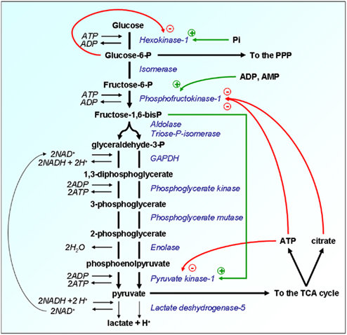

[[_0000 Home|Home]] | [[_0004 Sciences MOC|Back to Sciences MOC]] | [[SC Biochemistry index|Back to index]]
# Glycolysis

# **Gluconeogenesis**

# TCA

# Bioenergetics and AA synthesis pathways

# BE and AA synthesis pathways with structures

# Coagulation cascade

