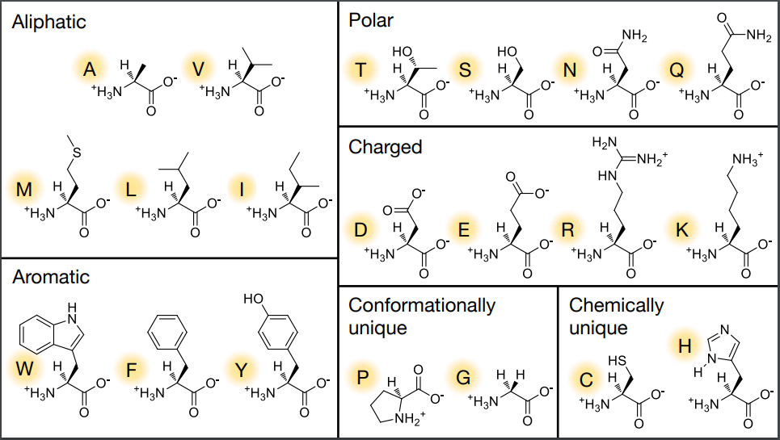

[[_0000 Home|Home]] | [[_0004 Sciences MOC|Back to Sciences MOC]] | [[SC Biochemistry index|Back to index]]
# 1- Amino acids:

# 2- Functional groups

# 3- Nucleic acids

# 4- Residue secondary structure preference

# 5- Lipids

