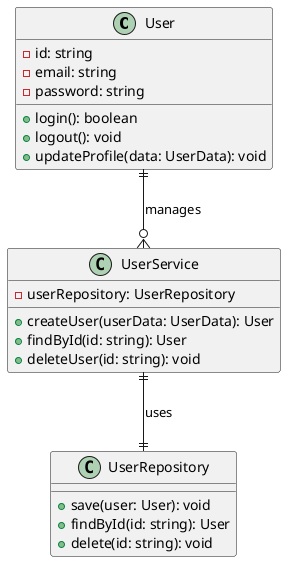
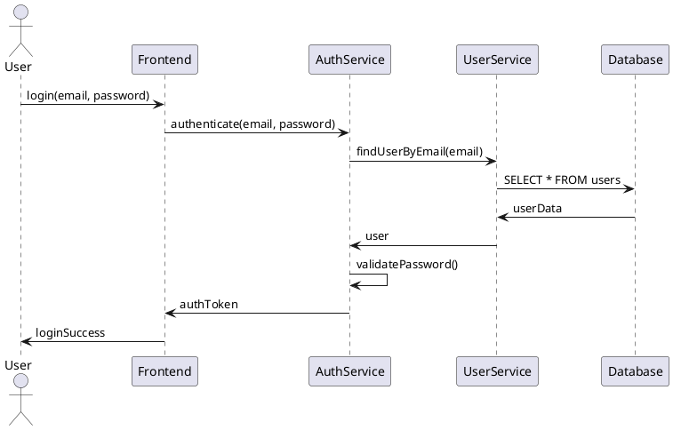
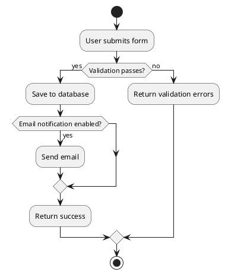
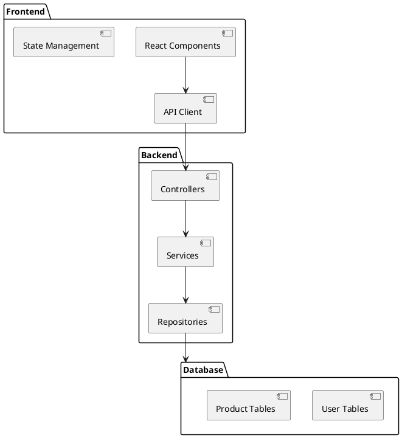
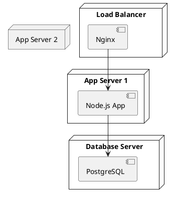
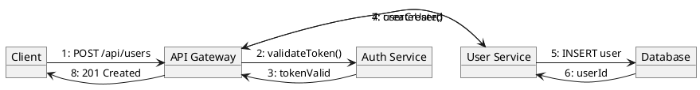

---
tags:
  - MOC
MOC: Main
---

# Top level MOCs
[[_0001 Technology MOC]]
[[_0002 Work MOC]]
[[_0003 Personal MOC]]
[[_0004 Sciences MOC]]
[[_0005 Cybersecurity MOC]]
[[_0006 Programming MOC]]

# Dataview commands
```sql
-- Shows all files in a table based on their last modification time (.mtime)
table file.mtime AS "Last Modified" SORT file.mtime DESC
```

```sql
-- Stating list/table/etc will select all files by default.
-- contains(list, value) takes a list and a value from that list and filters by it. e.g. Here we filter from all tags by EH to get all EH related files
list where contains(tags, "EH")
```

```sql
-- Using Frontmatter data
table where moc = "Programming"
```

```plantuml
Bob -> Alice : hello
Alice -> Wonderland: hello
Wonderland -> next: hello
next -> Last: hello
Last -> next: hello
next -> Wonderland : hello
Wonderland -> Alice : hello
Alice -> Bob: hello
```
# Class

# Sequence

# Activity

# Package/Component


# Deployment


# Communication


